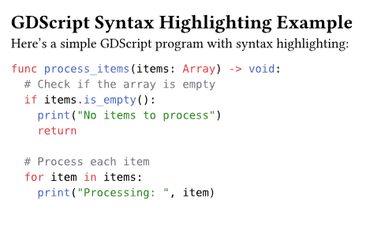

# codegds

GDscript syntax highlighting for [Typst](https://typst.app/).



## Installation

````typst
#import "@preview/codeforth:0.1.0": forth-syntax
#set raw(syntaxes: forth-syntax)

```forth
: fun 1 2 + ;
```
````

## Credits

- Syntax patterns informed by [dementive/SublimeGodot](https://github.com/dementive/SublimeGodot)

## License

MIT
